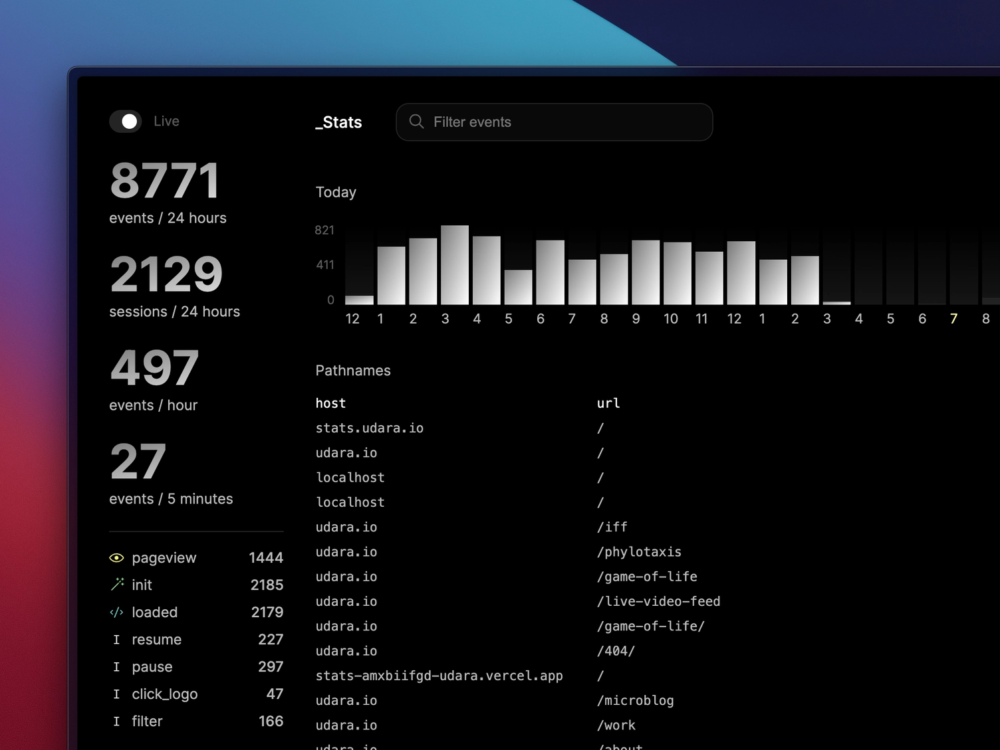

# \_Stats: A real-time analytics dashboard

A self-hosted, real-time, analytics dashboard with support for custom events and privacy preserving tracking. If you're looking for simple analytics software for a small–medium traffic website, this could be the right fit for you.



## Getting Started

1. Update the config at [./src/config](./src/config.ts)
2. Setup a database of your choosing and set the appropriate configuration in [./prisma/schema.prisma](./prisma/schema.prisma). You can take a look at all the supported databases in the [Prisma docs](https://www.prisma.io/docs/reference/database-reference/supported-databases)

### Start tracking events

Once you have the application running, you can embed some javascript on sites you want to track events from.

Place the code in the <head> of your page and remember to add the domain to the `CORS_ALLOWED_ORIGIN` array in [./config](./src/config.ts) inorder to allow cross-origin requests.

```HTML
<script async src="https://your-app-diomain.com/api/stats.js" />
```

Once the script is loaded you can record events like so:

```javascript
collect('event_name');

// or

window.collectAnalytics('event_name');
```

## Next js

This app is built using Next.js, so take a look at their documentation to better understand how the app is structured.

Run the development server:

```bash
npm run dev
```

To learn more about Next.js, take a look at the following resources:

- [Next.js Documentation](https://nextjs.org/docs) - learn about Next.js features and API.
- [Learn Next.js](https://nextjs.org/learn) - an interactive Next.js tutorial.

You can check out [the Next.js GitHub repository](https://github.com/vercel/next.js/) - your feedback and contributions are welcome!

## Deploy on Vercel

The easiest way to deploy a Next.js app is to use the [Vercel Platform](https://vercel.com/new?utm_medium=default-template&filter=next.js&utm_source=create-next-app&utm_campaign=create-next-app-readme) from the creators of Next.js.

Check out [Next.js deployment documentation](https://nextjs.org/docs/deployment) for more details.
